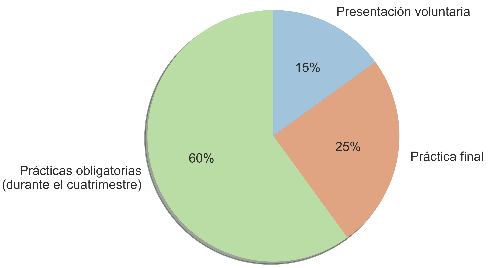

## Sobre mí

**Juan Carlos Sáez Alcaide** (<jcsaezal@ucm.es>)

::: incremental 

* Prof. del Dpto. Arquitectura de Computadores y Automática 

* Miembro del grupo de investigación [[ArTeCS]{.underline}](https://artecs.dacya.ucm.es/) 
	- Interacción entre el software de sistema y la arquitectura
	- Computación de altas prestaciones 
	- Arquitectura de computadores
	- ...

* Representante en la UCM de la asociación internacional USENIX
	- Login (USENIX Magazine) - [link a ejemplares en PDF](https://drive.google.com/drive/folders/0B2SwhQV-zKm2YVJmck9vUDh5ZzA?usp=sharing)  

:::

<!-- NOTES
* Muy buenos días a todos.
	- Buenas, Soy Juan Carlos Sáez y vengo a presentaros la asignatura AILA	
* Esta presentación la tenéis accesible en esta URL: 
	- Os la comparto para que tengáis mis datos de contacto y tengáis acceso a algunos enlaces....
---
* Bueno aquí tenéis mi dirección de correo
* Sobre mí merece la pena comentar que soy
	- Prof...
	- También soy miembro del Grupo de...
		* Aquí os dejo indicadas algunas de las cosas en las que investigamos...
		*
	- Y por último comentar que soy el representante en la UCM de la ...
		- Sede en la Universidad de Berkely
		- Sobre esta asoc: lo que más os puede interesar es su revista LOGIN que tiene artículos técnicos sobre seguridad y sistemas muy potentes
			* Aquí os dejo el enlace para acceder a esta revista con cuenta UCM..
			* Os lo comparto porque muchos de estos artículos tienen relación con lo que se ve en la asignatura...
-->

## Objetivo

* Estudio de aspectos avanzados de sistemas operativos
	- 2 créditos de teoría + 4 créditos de lab.

::: {.columns}

:::: {.column}

{width=70%}\  

:::: 

:::: {.column}

{width=70%}\ 

:::: 

:::

<!-- NOTES

Objetivo, analisis/estudio de aspectos avanzados de SO mediante el estudio de 2 casos prácticos
	- kernel Linix
	- SO android
-->

## Kernel Linux: evolución desde 1991

**Líneas de código de las distintas versiones**

{width=97%} \

::: {fontsize=footnotesize}

:::: {align=right}

Fuente: <https://www.linuxcounter.net>

::::

:::

<!-- NOTES
* La primera parte de la asignatura se centra en el estudio del kernel Linux, cuya complejidad no ha parado de crecer desde su creación en 1991
	- Como se muestra en esra figura el kernel que constaba inicialmente de unas decenas de miles de lineas de codigo a más de 20 millones en la actualidad
-->	

## Interactive map of the Linux kernel

{width=78%}\ 

::: {fontsize=footnotesize}

:::: {align=right}

Fuente: <http://www.makelinux.net/kernel_map>

::::

:::

<!-- NOTES
* Esta rápida evolución del kernel ha dado lugar a un monstruo que bien puede representarse mediante esta figura	
* Este diagrama recoge todos y cada uno de los subsistemas del kernel
	- Para cada subsistema (ZOOM), se muestran las estructuras y tipos de datos principales que se definen y usan
		- Así como una relación entre estos y los de otros susistemas...
* Bueno como curiosidad, comentar que en esta web de aquí tenéis accesible una versión interactiva de este diagrama
	- Donde no solo ZOOM sino que al hacer click en un tipo de datos nos lleva a la etiqueta correspondiente...
--
* Si alguien quiere contribuir a la comunidad de Linux creando parches y ser un verd. hacker del nucleo, no es una buena idea meterse a mirar el código directamente
	- Antes de nada es preciso conocer los aspectos o abstracciones comunes que están presentes en todos los subsistemas del núcleo 	
-->	

## Abstracciones comunes del kernel

* Estructuras de datos del kernel
* Implementación de llamadas al sistema
* Gestión de memoria dinámica
	- `kmalloc()`, `vmalloc()`, `kfree()`, `vfree()`
* Mecanismos para diferir el trabajo
* Temporizadores del kernel
* Pseudo sistemas de ficheros: /proc, /sys
* Mecanismos de sincronización en el kernel
* ...

<!-- NOTES
* Familiarizare con estas abstracciones comunes es el objetivo principal de las prácticas de la asignatura
* Aquí se recoge un listado de cosas que se usan por todo el kernel
	- Como ...
	- Por ejemplo, 2 mecanismos basicos de interacción con los 
		* IMpl... Pseudo sistemas de ficheros
	- Estructuras de datros genericas ...
	- BHW
* Al finalizar las prácticas, uno ya es capaz de dominar ... y puede afrontar más facilmente la labor de aprendizaje del kernel	
-->

## Uso de sistemas operativos 

[_Android OS está basado en el kernel Linux_]{color=blue}

{width=60% align=center}\ 

:::: {align=right}

Datos: <http://gs.statcounter.com/os-market-share>

::::

<!-- NOTES
* Una pregunta que surge de forma natural en torno al kernel Linux, es cuánto se usa en el mundo?
* Atendiendo a los datos recogidos en el último año y teniendo en cuenta el tráfico web registrado, el kernel Linux se usa una barbaridad (Const. más del 40% del mercado mundial)
	- Pero sorprendentemente, el uso no viene de las dist. de Linux convencionales sino de usuarios de Android
	- Android, como me imagino que sabeis, es un SO basado en el kernel Linix
* Por lo tanto, el estudio del SO android es clave también..	
-->

## Android: a Linux-based OS

{width=70% align=center}\ 

<!-- NOTES
* La segunda parte de la asignatura está destinada al análisis de la arquitectura interna de ANdroid
	- En esta segunda parte veremos que Android es muy diferente a GNU Linux
	- Veremos de hecho las diferencias entre El kernel linux convencional y el que usa android, que tiene extensiones muy particulares
-->

## Programa

* **[Módulo 1]{color=red}**: **Introducción** 
	- Historia Unix/Linux y Estructura del SO
	- Uso avanzado de módulos del kernel Linux
* **[Módulo 2]{color=red}**: **Llamadas al sistema**
	- Compilación del kernel Linux
* **[Módulo 3]{color=red}**: **Drivers USB**
* **[Módulo 4]{color=red}**: **Gestión de Procesos**
	- Gestión de procesos en Linux
	- Mecanismos de sincronización del kernel
* **[Módulo 5]{color=red}**: **Gestión de interrupciones y trabajos diferidos**
	- Softirqs, Tasklets, Workqueues y Temporizadores del kernel 
* **[Módulo 6]{color=red}**: **Arquitectura Interna de Android**
	- Introducción a Android: Componentes, Android vs. GNU/Linux
	- Procesos en Android, Kernel y Native Userspace

<!-- NOTES
[PROGRAMA]
- El programa de AILA está estructurado en estos 6 módulos:
	- Esta información la tenéis en la ficha de la asignatura así que no me paro a detallarla
-->

## Prácticas 

::: incremental

* Sobre una Máquina Virtual de GNU/Linux
	- Programación en "C" en modo kernel
	-  ... casi siempre con módulos cargables del núcleo
* 5 prácticas
	1. Uso avanzado de módulos del kernel
	1. Implementación de llamadas al sistema 
	1. Desarrollo de driver para un dispositivo USB
	1. Gestión de procesos y sincronización en el kernel
	1. Gestión de interrupciones y trabajos diferidos

:::

<!-- NOTES
[PASAR A PRACTICAS!!]
- Bueno hablemos ahora de las prácticas...
- Las prácticas de la asignatura serán sobre Linux
	*  [2 cosas: LAB y DESCARGA...] Para ello usareis una MV que hay instalada en el lab y que os podéis descargar
	* Esta máquina contiene una distribución Debian de 64 bits 
	* Para las prácticas se usará obligatoriamente el kernel linux v ….
		- Esta es una versión muy reciente del kernel (Finales de julio de este año) 
			* Se ha escogido esa version específica, porque esta se usa en muchas versiones de Android
				- Concretamente, en la MV de android que usaremos hay una versión del kernel similar
				- Está bien que manejeis
		- Es obligatorio usar este kernel
			* Las transparencias documentan exactamente las funciones del API de esta versión del kernel
- Bueno, concretamente habrá 5 prácticas, cuya temática teneis aquí disponible
	1. Módulos del kernel Linux
	2. Implementación de llamadas al sistema
	3. Procesos y Sincro
	4. Interrupciones y mecanismos para diferir el trabajo en Linux
-->

## Prácticas 

En la práctica 3 se desarrollará un driver en Linux para el dispositivo Blinkstick Strip (USB)

::: {.columns}

:::: {.column}

{width=80%}\  

:::: 

:::: {.column}

{width=80%}\ 

:::: 

:::

<!--
{width=50%}\ 

{width=50%}\ 
{width=50%}\ 

[SKIP SI SOLOS]
* Es muy importante que gestionemos esto de los grupos cuanto antes
[COMMON]
* Este año en una de las prácticas vais a tener que desarrollar un driver para gestionar un dispositivo USB especial: Blinks 
	* Y para que lo toméis prestado con antelación tengo que dar permiso a uno de los dos miembros del grupo 
		- No hay suficientes BS para todos
		- Para eso es necesario
* Por cierto, este dispositivo USB con el que váis a tener que trabajar consta de unos 8 leds de colores que se pueden manipular de forma independiente
		- Como los leds son bastante potentes, ya os diré que colores no usar para que no os quedéis ciegos durante las prácticas (bueno es una exageracion... pero bueno ya ...)
	- La cuestion es que una parte de la P2 consiste en desarrollar un driver en Linux para este dispositivo USB
* En principio solo se puede hacer un préstamo por grupo, así que necesito saber ..	
* POR AHORA NO PODÉIS TOMARLO PRESTADO, pero ya os avisaré cuando podáis hacerlo
-->	

## Método de evaluación 

[**Dos modalidades a elegir**]{color=blue}

A) Examen final:  
	- *NotaFinal=NotaExamen*
B) Evaluación continua:
	- Asistencia obligatoria

{width=60% align=center}\ 

<!-- NOTES
[EN EL CASO DE QUE EV CONTINUA!!!!]
- En el caso de que opteis por el método de evaluación continua que yo os recomiendo
	- aquí podéis ver como se calcula la nota final
	- En el cálculo hay tres factores
		1. La nota de las prácticas de la asignatura
		2. La nota de la práctica final que ahora contaré en qué consiste
		3. La nota de la presentación/Exposición
	- La nota prácticas tiene un peso ..
[ DEjar un hueco para que lo vean]
- Si hacéis las cuentas, efectivamente se puede aprobar haciendo solamente las prácticas
	- Eso sí, teneis que asistir a clase regularmente para cumplir req. de asistencia
	- Si alguna práctica la entregais tarde o funcionando medio bien podéis compensar haciendo la práctica …
- HASTA AQUÍ ALGUNA DUDA…
	- ...			
-->

## 

{width=80% align=center}\ 

Presentación disponible en <http://bit.ly/2wJ4fqH>

