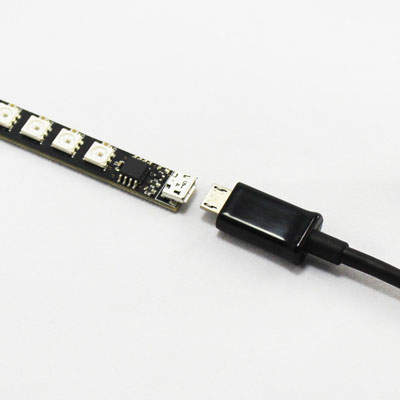

## Sobre mí

* **Juan Carlos Sáez Alcaide** (<jcsaezal@ucm.es>)
	- Dpto. Arquitectura de Computadores y Automática 
	
* Miembro del grupo de investigación [[ArTeCS]{.underline}](https://artecs.dacya.ucm.es/) 
	- Interacción entre el software de sistema y la arquitectura
	- Computación de altas prestaciones 
	- Arquitectura de computadores
	- ...

* Representante en la UCM de la asociación internacional USENIX
	- USENIX Symposium on Operating Systems Design and Implementation (OSDI)
	- USENIX Annual Technical Conference (ATC)
	- Login (USENIX Magazine) - [\underline{link} a ejemplares en PDF](https://drive.google.com/drive/folders/0B2SwhQV-zKm2YVJmck9vUDh5ZzA?usp=sharing)  

<!-- NOTES
* Muy buenas tardes a todos
	- [Pasar slide]
	
* Para aquellos que no me conozcais, soy Juan Carlos Saez (Prof. del DPTO )
	* MI CORREO AQUI.. 
* También soy miembro del GINV... 
	- Aquí se muestran algunas de los temas de inv. en los que trabajamos en el grupo como ...
* QUIZAS DE CARA A ESTA ASIGNATURA LO MAS RELEVANTE QUE DEBEIS SABER DE MI
	- Representante ...
		* Alguien ha oido? [Mal asunto]
		* Organización internacional con sede en la universidad de Berkely CALIFORNIA, que entre otras cosas se ocupa de organizar congresos de gran relevancia en el ámbito de sistemas op, SF y SOBRE TODO SEG
			- MÁS representatuvi...
				* Mas relevantes en seguridad que existen
		* Como rep: os he de comentar que si deseais asistir, podría conseguiros la inscripción gratis (El viaje a donde sea no, pero si la insc) 600 euros...
	- Otro aspecto significativo de la asociacion es la revista login, que saca al menos 4 veces al año
		- Contiene artículos técnicos y de investigación sobre seguridad
		- Yo os recomiendo que le echeis un ojo
			* Enlace para descargar
-->

## Objetivo

* Estudio de la arquitectura interna:

::: {.columns}

:::: {.column}

{width=70%}\  

:::: 

:::: {.column}

{width=70%}\ 

:::: 

:::

<!-- NOTES

* Profundizar en los conceptos adquiridos en la asignatura _Sistemas Operativos_ 
* Especial hincapié en 
	1. Programación en modo kernel
	1. Principales abstracciones _transversales_ del kernel
	1. Interacción modo usuario - modo kernel
	1. Interacción entre el HW y el SW
* Estudio de casos prácticos
	- kernel Linux
	- SO Android 

- El principal objetivo de esta asignatura es profundizar en .... haciendo especial hincapie en 4 aspectos clave de los SO
	1. Programación en MK e Interaccion MK/MU
	2. Escenarios de interacción entre el HW y el SW a nivel
- Todo esto se intenta llevar a cabo con un enfoque muy práctico, en el que haremos un estudio del kernel Linux y de la arquitectura interna del SO Android
	* Como me imagino que ya sabeis, Android está basado en el kernel Linux
	* Mediante el conocimiento del kernel en sí, iniciaremos el estudio en produndidad de Android	
-->

## Kernel Linux: evolución desde 1991

\centering

**Líneas de código de las distintas versiones**

{width=97%} \

\begin{flushright}
\tiny
Source: https://www.linuxcounter.net
\end{flushright}

## Interactive map of the Linux kernel

\vspace{-0.2cm}

\centering

{width=78%} \

\footnotesize

`http://www.makelinux.net/kernel_map/`

<!-- NOTES
* Este diagrama, que es más bien informal recoge todos y cada uno de los subsistemas del kernel
	- Para cada subsistema (ZOOM), se muestran las estructuras y tipos de datos principales que se definen y usan
		- Así como una relación entre estos y los de otros susistemas...
* ESTO ES MÁS REPRESENTATIVO DEL KERNEL LINUX ACTUAL...
	- Algo muy complejo
* Bueno como curiosidad, comentar que en esta web de aquí tenéis accesible una versión interactiva de este diagrama
	- Donde no solo ZOOM sino que al hacer click en un tipo de datos nos lleva a la etiqueta correspondiente...
-->	

## Abstracciones comunes del kernel

* Implementación de llamadas al sistema
* Pseudo sistemas de ficheros: /proc, /sys
* Estructuras de datos del kernel
* Gestión de memoria dinámica
	- `kmalloc()`, `vmalloc()`, `kfree()`, `vfree()`
* Mecanismos para diferir el trabajo
* Temporizadores del kernel
* Mecanismos de sincronización en el kernel
* ...

<!-- NOTES
* Aquí se recoge un listado de cosas que se usan por todo el kernel
	- Por ejemplo, 2 mecanismos basicos de interacción con los 
		* IMpl... Pseudo sistemas de ficheros
	- Estructuras de datros genericas ...
	- BHW
* Si uno conoce estas cosas, ya es mucho más facil seguir la ejecucion (no tiene nada que ver vamos...)	
-->

## Uso de sistemas operativos en el último año

{width=60% align=center}\ 

<!--
Datos: http://gs.statcounter.com/os-market-share
-->

## Android: a Linux-based OS

{width=70% align=center}\ 

<!-- NOTES
* En la actualidad la versión "Androidizada" del kernel constituye un *fork* sustancial de Linux
---
* Pasemos a ver una visión general sobre la arquitectura interna y los componentes de Android.
	- Este diagrama refleja las 4 capas de software en la arquitecura de Android
* [ Descripción de las Capas ]
	1. En la capa de más alto nivel se encuentran las aplicaciones de usuario en Android que se desarrollan en Java
	2. La capa inmediatamente inferior está formada por distintos Servicios del Sistema que constituten el Application Framework
		- La seña de identidad de Android se encuentra en esta capa que ha sido desarrollada enteramente por Google
	3. Justo por debajo se situan dos componentes críticos de Android: Las librerías y el Android Runtime
	4. La capa inferior de la arquitectura está formada por el kernel Linux
[COMENTARIOS DE LENGUAJES DE PROGRAMACIÓN]	
* A pesar de que ahora le vamos a dedicar tiempo a describir cada capa aprovecho este diagrama para que tengáis una idea de qué lenguaje o lenguajes de programación se utilizan en cada nivel
	1. Esencialmente todo lo que aparece en azul constituye código Java
		- Es cierto que excepcionalemente se puede invocar código "C" nativo en algunos casos, pero mayoritariamente es Java
	2. Las Librerías nativaes y La MV Dalvik están programadas en C o C++ 
	3. Finalmente, como sabéis el kernel Linux está programado en C puro aunque también se usa ensamblador para realizar tareas de Bajo nivel
* Todos estos lenguajes de programación se utilizan en Android…
-->

## Programa

* **[Módulo 1]{color=red}**: **Introducción** 
	- Historia Unix/Linux y Estructura del SO
	- Uso avanzado de módulos del kernel Linux
* **[Módulo 2]{color=red}**: **Llamadas al sistema**
	- Compilación del kernel Linux
* **[Módulo 3]{color=red}**: **Drivers USB**
* **[Módulo 4]{color=red}**: **Gestión de Procesos**
	- Gestión de procesos en Linux
	- Mecanismos de sincronización del kernel
* **[Módulo 5]{color=red}**: **Gestión de interrupciones y trabajos diferidos**
	- Softirqs, Tasklets, Workqueues y Temporizadores del kernel 
* **[Módulo 6]{color=red}**: **Arquitectura Interna de Android**
	- Introducción a Android: Componentes, Android vs. GNU/Linux
	- Procesos en Android, Kernel y Native Userspace

<!-- NOTES
- Más cosas...
[PROGRAMA]
- El programa de AILA está estructurado en estos 6 módulos:
	- ENUM: LINUX ...
	- Por último el modulo 6 de la asignatura se centra en ver en detalle la arquitectura interna del SO Android
		- [DIFERENCIAS/SIMILITUDES] Aquí también versmos cuales son los asp. similares y las diferencias entre GNU/Linux ... y Android
[DETALLES EL PRIMER MODULO]
- Como he comentado antes
	- Hoy comenzaremos con el Primer modulo
		* En este primer modulo que nos llevará estas 2 primeras semamans de clase
		* Veremos una breve Introducción sobre los sistemas UNIX y LInux, y la estr del SO
		*  A cont. veremos aspectos avanzados sobre los módulos, que usaréis en la primera práctica de la asignatura

-->

## Prácticas 

* Sobre una Máquina Virtual de GNU/Linux
	- Programación en "C" en modo kernel
	-  ... casi siempre con módulos cargables del núcleo
* 5 prácticas
	1. Uso avanzado de módulos del kernel
	1. Implementación de llamadas al sistema 
	1. Desarrollo de driver para un dispositivo USB
	1. Gestión de procesos y sincronización en el kernel
	1. Gestión de interrupciones y trabajos diferidos

<!-- NOTES
[PASAR A PRACTICAS!!]
- Bueno hablemos ahora de las prácticas...
- Las prácticas de la asignatura serán sobre Linux
	*  [2 cosas: LAB y DESCARGA...] Para ello usareis una MV que hay instalada en el lab y que os podéis descargar
	* Esta máquina contiene una distribución Debian de 64 bits 
	* Para las prácticas se usará obligatoriamente el kernel linux v ….
		- Esta es una versión muy reciente del kernel (Finales de julio de este año) 
			* Se ha escogido esa version específica, porque esta se usa en muchas versiones de Android
				- Concretamente, en la MV de android que usaremos hay una versión del kernel similar
				- Está bien que manejeis
		- Es obligatorio usar este kernel
			* Las transparencias documentan exactamente las funciones del API de esta versión del kernel
- Bueno, concretamente habrá 5 prácticas, cuya temática teneis aquí disponible
	1. Módulos del kernel Linux
	2. Implementación de llamadas al sistema
	3. Procesos y Sincro
	4. Interrupciones y mecanismos para diferir el trabajo en Linux
-->

## Prácticas 

* En la práctica 3 se desarrollará un driver en Linux para el dispositivo Blinkstick Strip (USB)

{width=50%}\ 

{width=50%}\ 
{width=50%}\ 

<!--
[SKIP SI SOLOS]
* Es muy importante que gestionemos esto de los grupos cuanto antes
[COMMON]
* Este año en una de las prácticas vais a tener que desarrollar un driver para gestionar un dispositivo USB especial: Blinks 
	* Y para que lo toméis prestado con antelación tengo que dar permiso a uno de los dos miembros del grupo 
		- No hay suficientes BS para todos
		- Para eso es necesario
* Por cierto, este dispositivo USB con el que váis a tener que trabajar consta de unos 8 leds de colores que se pueden manipular de forma independiente
		- Como los leds son bastante potentes, ya os diré que colores no usar para que no os quedéis ciegos durante las prácticas (bueno es una exageracion... pero bueno ya ...)
	- La cuestion es que una parte de la P2 consiste en desarrollar un driver en Linux para este dispositivo USB
* En principio solo se puede hacer un préstamo por grupo, así que necesito saber ..	
* POR AHORA NO PODÉIS TOMARLO PRESTADO, pero ya os avisaré cuando podáis hacerlo
-->	

## Prácticas (I)

* Sobre GNU/Linux Debian 9.5 ("stretch")
	- Máquina Virtual del laboratorio (64 bits)
	- Linux Kernel v4.9.111 (julio de 2018) 
* 5 prácticas
	1. Uso avanzado de módulos del kernel
	1. Implementación de llamadas al sistema 
	1. Desarrollo de driver para un dispositivo USB
	1. Gestión de procesos y sincronización en el kernel
	1. Gestión de interrupciones y trabajos diferidos

<!-- NOTES
[PASAR A PRACTICAS!!]
- Bueno hablemos ahora de las prácticas...
- Las prácticas de la asignatura serán sobre Linux
	*  [2 cosas: LAB y DESCARGA...] Para ello usareis una MV que hay instalada en el lab y que os podéis descargar
	* Esta máquina contiene una distribución Debian de 64 bits 
	* Para las prácticas se usará obligatoriamente el kernel linux v ….
		- Esta es una versión muy reciente del kernel (Finales de julio de este año) 
			* Se ha escogido esa version específica, porque esta se usa en muchas versiones de Android
				- Concretamente, en la MV de android que usaremos hay una versión del kernel similar
				- Está bien que manejeis
		- Es obligatorio usar este kernel
			* Las transparencias documentan exactamente las funciones del API de esta versión del kernel
- Bueno, concretamente habrá 5 prácticas, cuya temática teneis aquí disponible
	1. Módulos del kernel Linux
	2. Implementación de llamadas al sistema
	3. Procesos y Sincro
	4. Interrupciones y mecanismos para diferir el trabajo en Linux
-->

## Método de evaluación 

* Dos modalidades a elegir
	- Examen final:  *NotaFinal=NotaExamen*
	- Evaluación continua:
		- Asistencia obligatoria

{width=60% align=center}\ 

<!-- NOTES
[EN EL CASO DE QUE EV CONTINUA!!!!]
- En el caso de que opteis por el método de evaluación continua que yo os recomiendo
	- aquí podéis ver como se calcula la nota final
	- En el cálculo hay tres factores
		1. La nota de las prácticas de la asignatura
		2. La nota de la práctica final que ahora contaré en qué consiste
		3. La nota de la presentación/Exposición
	- La nota prácticas tiene un peso ..
[ DEjar un hueco para que lo vean]
- Si hacéis las cuentas, efectivamente se puede aprobar haciendo solamente las prácticas
	- Eso sí, teneis que asistir a clase regularmente para cumplir req. de asistencia
	- Si alguna práctica la entregais tarde o funcionando medio bien podéis compensar haciendo la práctica …
- HASTA AQUÍ ALGUNA DUDA…
	- ...			
-->

## 

{width=80% align=center}\ 

