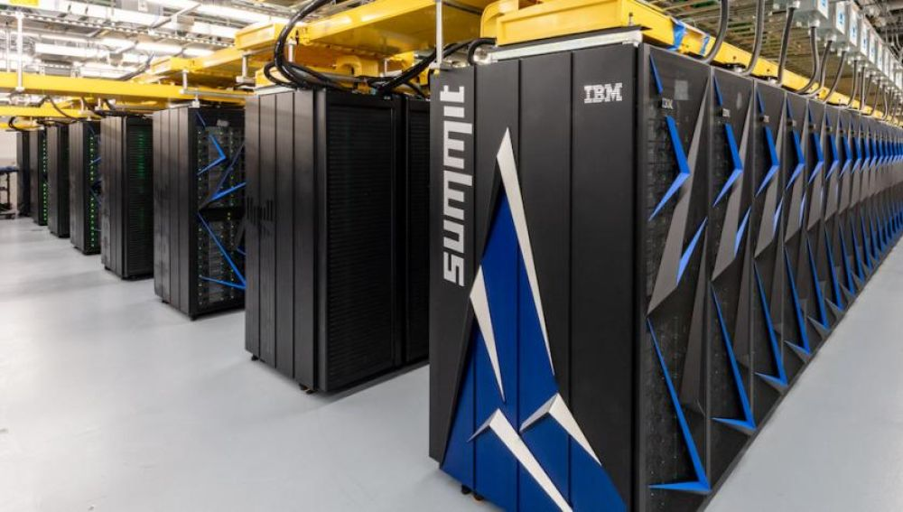

## Sobre mí

**Juan Carlos Sáez Alcaide** (<jcsaezal@ucm.es>)

::: incremental 

* Prof. del Dpto. Arquitectura de Computadores y Automática 

* Miembro del grupo de investigación [[ArTeCS]{.underline}](https://artecs.dacya.ucm.es/) 
	- Optimización de software de sistema para nuevas arquitecturas
	- Computación de altas prestaciones 
	- Arquitectura de computadores
	- ...

* Representante en la UCM de la asociación internacional USENIX
	- Login (USENIX Magazine) - [link a ejemplares en PDF](https://drive.google.com/drive/folders/0B2SwhQV-zKm2YVJmck9vUDh5ZzA?usp=sharing)  

:::

## Objetivo

* Estudio de aspectos avanzados de sistemas operativos
	- 2 créditos de teoría + 4 créditos de lab 
	- Horario (Primer Cuatrimestre): X,V 14:00h-16:00h

::: {.columns}

:::: {.column}

{width=60%}\  

:::: 

:::: {.column}

{width=60%}\ 

:::: 

:::

## Kernel Linux: evolución desde 1991

**Líneas de código de las distintas versiones**

{width=97%} \

::: {fontsize=footnotesize}

:::: {align=right}

Fuente: <https://www.linuxcounter.net>

::::

:::

## Interactive map of the Linux kernel

{width=78%}\ 

::: {fontsize=footnotesize}

:::: {align=right}

Fuente: <http://www.makelinux.net/kernel_map>

::::

:::

## Abstracciones comunes del kernel

* Estructuras de datos del kernel

* Implementación de llamadas al sistema

* Gestión de memoria dinámica
	
	- `kmalloc()`, `vmalloc()`, `kfree()`, `vfree()`
	
* Mecanismos para diferir el trabajo

* Temporizadores del kernel

* Pseudo sistemas de ficheros: /proc, /sys

* Mecanismos de sincronización en el kernel

* ...

	

## ¿Por qué aprender Linux?

* Usado en los 500 supercomputadores más potentes del mundo
	* [<https://www.zdnet.com/article/linux-totally-dominates-supercomputers/>]{fontsize=footnotesize}
	* [<https://www.top500.org/statistics/details/osfam/1/>]{fontsize=footnotesize}

{width=70% align=center}\ 

## Uso de sistemas operativos 

[_Android OS está basado en el kernel Linux_]{color=blue}

{width=65% align=center}\ 

:::: {align=right}

Datos: <http://gs.statcounter.com/os-market-share>

::::

## Android: a Linux-based OS

{width=70% align=center}\ 

## Programa

* **[Módulo 1]{color=red}**: **Introducción** 
	- Historia Unix/Linux y Estructura del SO
	- Uso avanzado de módulos del kernel Linux
* **[Módulo 2]{color=red}**: **Llamadas al sistema**
	- Compilación del kernel Linux
* **[Módulo 3]{color=red}**: **Drivers USB**
* **[Módulo 4]{color=red}**: **Gestión de Procesos**
	- Gestión de procesos en Linux
	- Mecanismos de sincronización del kernel
* **[Módulo 5]{color=red}**: **Gestión de interrupciones y trabajos diferidos**
	- Softirqs, Tasklets, Workqueues y Temporizadores del kernel 
* **[Módulo 6]{color=red}**: **Arquitectura Interna de Android**
	- Introducción a Android: Componentes, Android vs. GNU/Linux
	- Procesos en Android, Kernel y Native Userspace

## Prácticas 

::: incremental

* Sobre una Máquina Virtual de GNU/Linux
	- Programación en "C" en modo kernel
	-  ... casi siempre con módulos cargables del núcleo
* 5 prácticas
	1. Uso avanzado de módulos del kernel
	1. Implementación de llamadas al sistema 
	1. Desarrollo de driver para un dispositivo USB
	1. Gestión de procesos y sincronización en el kernel
	1. Gestión de interrupciones y trabajos diferidos

:::

## Prácticas 

En la práctica 3 se desarrollará un driver en Linux para el dispositivo Blinkstick Strip (USB)

::: {.columns}

:::: {.column}

{width=80%}\  

:::: 

:::: {.column}

{width=80%}\ 

:::: 

:::

## Método de evaluación 

[**Dos modalidades a elegir**]{color=blue}

A) Examen final:  
	- *NotaFinal=NotaExamen*
B) Evaluación continua:
	- Asistencia obligatoria

{width=60% align=center}\ 

<!--

## Organización sesiones curso 2020-21

* Miércoles 14-16h (Online)
	* Teoría + Laboratorio
* Viernes  14-16h (Presencial)
	* Laboratorio (2h)

-->

## 

{width=80% align=center}\ 

Presentación disponible en <http://bit.ly/2wJ4fqH>

